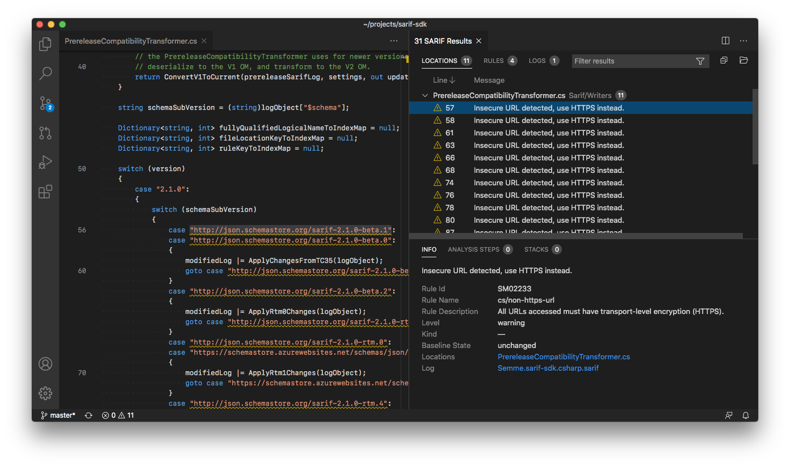

# SARIF Viewer for Visual Studio Code

A [Visual Studio Code](https://code.visualstudio.com/) [extension](https://marketplace.visualstudio.com/VSCode) that adds support for viewing [SARIF](https://sarifweb.azurewebsites.net/) logs. SARIF log results can be viewed as squiggles in your source, in the Problems list, or in a dedicated **SARIF Results Panel**. The **SARIF Results Panel** offers richer grouping, filtering, column, and details options over the standard Problems list.



## What's New?

Version 3 incorporates many feedback-based improvements:
* Improved keyboard accessibility within the **SARIF Results Panel**. Arrow key through the list of results.
* Resizable details section within the **SARIF Results Panel**.
* Generally improved performance and responsiveness.
* Automatic reconciliation of URIs between the SARIF log and your local workspace in most cases.

To focus our efforts, we have dropped some less-used and less-reliable features:
* Support for old SARIF versions - We now strictly support the public standard version 2.1.0. Older versions can be upgraded with the standalone SARIF Multitool (via [nuget](https://www.nuget.org/packages/Sarif.Multitool/) and [npm](https://www.npmjs.com/package/@microsoft/sarif-multitool)).
* Conversion of external formats to SARIF - We recommend the standalone SARIF Multitool (via [nuget](https://www.nuget.org/packages/Sarif.Multitool/) and [npm](https://www.npmjs.com/package/@microsoft/sarif-multitool)) for conversion.
* **SARIF Results Panel** (previously "SARIF Explorer") view state is no longer exposed as settings.
* The `rootpaths` setting as been removed.

If these changes adversely affect your project, please [let us know](https://github.com/microsoft/sarif-vscode-extension/issues).

## Usage

Install this extension from the [Extension Marketplace](https://code.visualstudio.com/docs/editor/extension-gallery) within Visual Studio Code.

SARIF logs (`*.sarif`) can be opened several ways:
* Open as a document. The **SARIF Results Panel** will automatically be shown.
* Manually show the **SARIF Results Panel** with command `sarif.showPanel`. Then click "Open SARIF log". If logs are already open, open additional logs via the folder icon at the top of the **SARIF Results Panel**.
* Call from another extension. See the "API" section below.

We welcome feedback via [issues](https://github.com/microsoft/sarif-vscode-extension/issues).

## API
An [extension-to-extension public API](https://code.visualstudio.com/api/references/vscode-api#extensions) is offered. This API is defined at `src/extension/index.d.ts`. An example of another extension calling this extension:
```javascript
const sarifExt = extensions.getExtension('MS-SarifVSCode.sarif-viewer');
if (!sarifExt.isActive) await sarifExt.activate();
await sarifExt.exports.openLogs([
   Uri.file('c:/samples/demo.sarif'),
]);
```
Note: TypeScript typings for `Extension<T>` are forthcoming.

## Telemetry
We collect basic anonymous information such as activation and the versions/schemas of any logs opened. Opt-in or out via the general Visual Studio Code setting `telemetry.enableTelemetry`.

## Development

`F5` launches this extension. Subsequent changes are watched and rebuilt. Use command `workbench.action.reloadWindow` to see the changes. For more details see [Contributing to SARIF Viewer](CONTRIBUTING.md).

Other common tasks:

| Command | Comments |
| --- | --- |
| `npm run server` | Run the `Panel` standalone at `http://localhost:8000`. Auto-refreshes. |
| `npm test` | Run and watch unit tests. Bails on failure. Useful during development.
| `npm test -- --bail false --watch false` | Run tests once. Useful for reporting.
| `npx webpack` | Build manually. |
| `npx @vscode/vsce package` | Produce a VSIX. |
